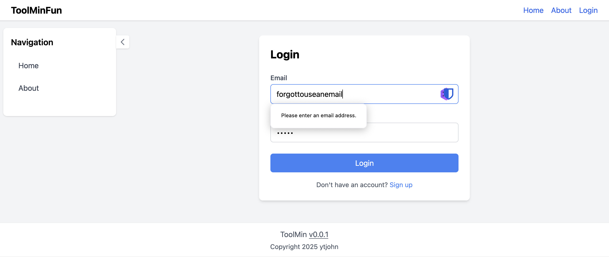
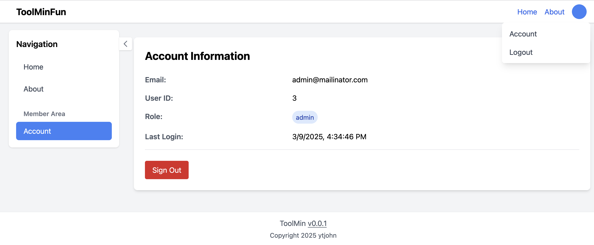
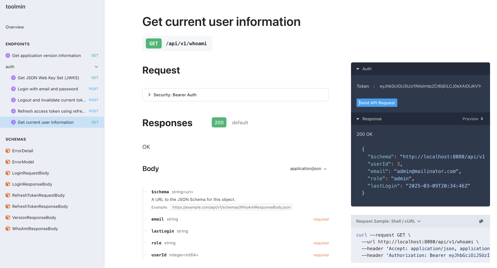
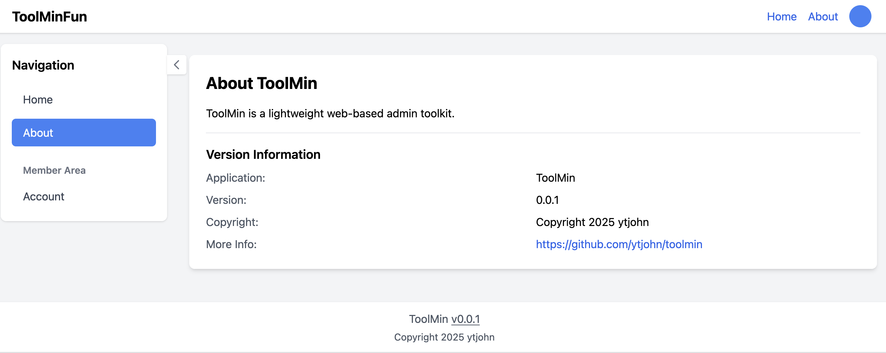
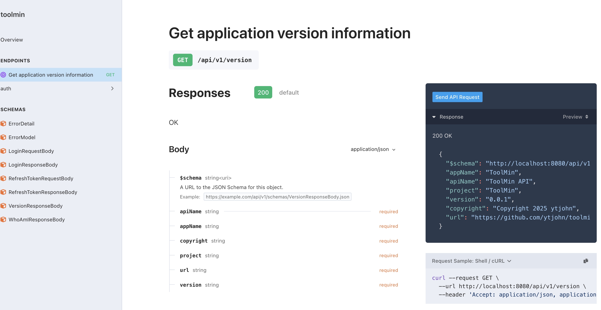

# ToolMin

Just Enough Tooling

Toolmin is a lightweight web-based admin toolkit, with the ability to create tools using TCL (Tool Control Language). This is not finished, but provides a nice boilerplate template.

## Requirements

You'll need go1.23 or higher to compile it.

## Get Started

### Building and Running

To build:

```shell
make build
```

This will create `bin/toolmin`.

### Database Setup

The application uses SQLite3 for data storage. The database schema is embedded in the binary and can be initialized with:

```shell
# Initialize database (creates data/toolmin.db by default)
toolmin db init
```

The database location can be configured with the `TOOLMIN_DATABASE_PATH` environment variable:

```shell
TOOLMIN_DATABASE_PATH=/custom/path/db.sqlite toolmin db init
```

### User Management

Manage users from the command line:

```shell
# Get help with user command
toolmin user -h

# List all users
toolmin user list

# Create an admin user
toolmin user create -e admin@example.com -p adminpassword -r admin

# Create a normal user
toolmin user create -e user@example.com -p userpassword -r user

# Change a user's password
toolmin user passwd -e user@example.com -p newpassword

# Delete a user
toolmin user delete -e user@example.com
```

### Running the Server

Start the server with embedded web content:

```shell
toolmin serve
```

For development, use the local web directory:

```shell
toolmin serve --webdir web
```

The server supports the following environment variables:
- `TOOLMIN_SERVER_PORT`: Server port (default: 8080)
- `TOOLMIN_SERVER_HOST`: Server host (default: 127.0.0.1)
- `TOOLMIN_DEBUG`: Enable debug logging (default: false)

Example with environment variables:

```shell
TOOLMIN_SERVER_PORT=9000 TOOLMIN_SERVER_HOST=0.0.0.0 TOOLMIN_DEBUG=true toolmin serve
```

## Screenshots

### Login Page


### Authenticated User


### API Whoami with Auth


### About Page


### API Version Info


## Development

Key components:
- `cmd/cli`: Command-line interface and configuration
- `pkg/about`: Version and application information
- `pkg/appdb`: Generated database code and schema
  - `pkg/appdb/sql/schema`: Database schema definitions
  - `pkg/appdb/sql/queries`: SQL queries for SQLC
- `pkg/auth`: Authentication utilities
- `pkg/server`: Web server and API endpoints
- `web/`: Frontend assets and templates

### Web Server

The pkg/server is comprised of three parts:

First, the go server itself, which uses [huma.rocks](https://huma.rocks) as the api framework. Huma automatically generates openapi documentation around the api. When the server is running, http://localhost:8080/api/v1/docs gives you a UI to test out your backend.

Second, "pkg/server/middleware" provides a baseline middleware, starting with logging. As we add authenticated endpoints and other features, that middleware will go here.

Third, the server has an "spaFileServer" which serves up the content of "pkg/server/web" (or wherever your "webdir" is pointed at). It does some URL rewriting to default anything not an actual file to "index.html". So "/about" will be served by index.html.  

Basic rules of the spa file server:
1. If the path is to an actual file, serve the file directly. "/js/router.js" will get served direct.
2. For everything else, serve index.html

While this is written in go code, there is no reason a regular webserver (nginx, apache) with rewrite rules couldn't serve these pages directly. On the browser side, `index.html` is using htmx and `web/js/router.js` to load `web/templates/pages/about.html` into the content area. 

More specifically, it parses the url path and tries to load {path}.html from templates/pages. If the template file doesn't exist, or no path, then it loads home.html page.

```javascript
    const templatePath = `/templates/pages${path === '/' ? '/home' : path}.html`;
```

The index.html is basically an html template, with htmx triggers.

```html
    <div class="bg-white shadow rounded-lg p-4 mr-4">
        <div hx-get="/templates/partials/sidebar.html" 
                hx-trigger="load, auth:changed from:body"
                hx-swap="innerHTML"></div>
    </div>
```

With that code, htmx triggers on load, will fetch the sidebar partial, and putting the content inside of the hx-get div.

Current endpoints:
- Static file serving with SPA support
- API endpoints under `/api/v1/`
- API documentation at `/api/v1/docs`
- Version information at `/api/v1/version`

