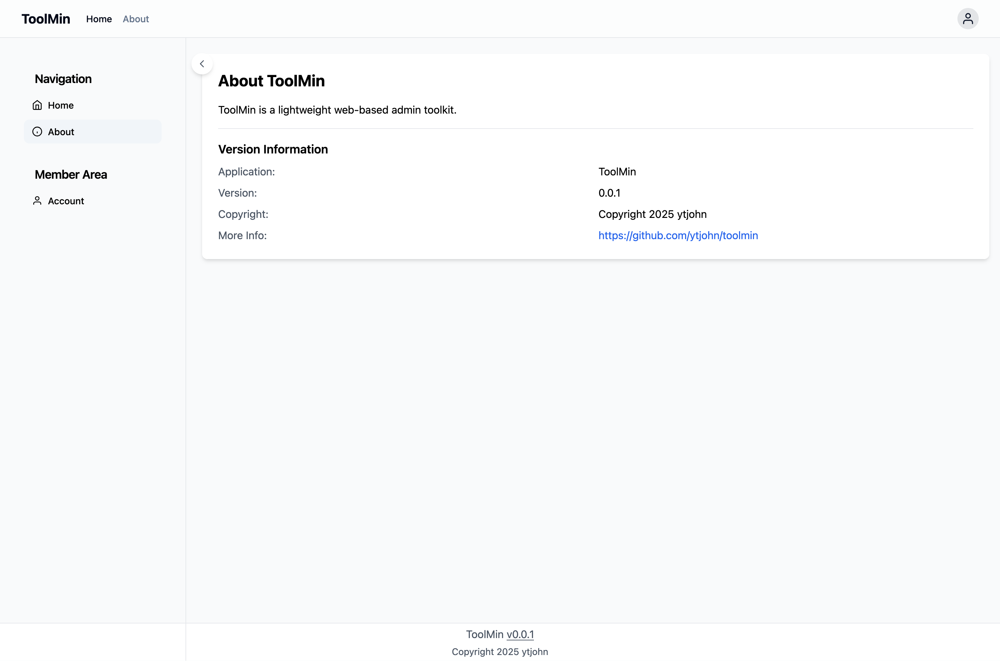

# ToolMin

Just Enough Tooling

Toolmin is a lightweight web-based admin toolkit, with the ability to create tools using TCL (Tool Control Language). This is not finished, but provides a nice boilerplate template.

## Quick Start

```bash
# Build the application
make build

# Initialize the database
bin/toolmin db init

# Create an admin user
bin/toolmin user create -e admin@example.com -p adminpassword -r admin

# Start the server
bin/toolmin serve
```

Visit http://localhost:8080 and log in with the created admin credentials.

## Requirements

You'll need go1.23 or higher to compile it.

## Get Started

### Building and Running

To build:

```shell
make build
```

This will create `bin/toolmin`.

### Database Setup

The application uses SQLite3 for data storage. The database schema is embedded in the binary and can be initialized with:

```shell
# Initialize database (creates data/toolmin.db by default)
toolmin db init
```

The database location can be configured with the `TOOLMIN_DATABASE_PATH` environment variable:

```shell
TOOLMIN_DATABASE_PATH=/custom/path/db.sqlite toolmin db init
```

### User Management

Manage users from the command line:

```shell
# Get help with user command
toolmin user -h

# List all users
toolmin user list

# Create an admin user
toolmin user create -e user@example.com -p userpassword -r user

# Change a user's password
toolmin user passwd -e user@example.com -p newpassword

# Delete a user
toolmin user delete -e user@example.com
```

### Running the Server

Start the server with embedded web content:

```shell
toolmin serve
```

For development, use the local web directory:

```shell
toolmin serve --webdir pkg/server/web
```

The server supports the following environment variables:
- `TOOLMIN_SERVER_PORT`: Server port (default: 8080)
- `TOOLMIN_SERVER_HOST`: Server host (default: 127.0.0.1)
- `TOOLMIN_DEBUG`: Enable debug logging (default: false)

Example with environment variables:

```shell
TOOLMIN_SERVER_PORT=9000 TOOLMIN_SERVER_HOST=0.0.0.0 TOOLMIN_DEBUG=true toolmin serve
```

## Screenshots

### Login Page


### Authenticated User


### About Page


### API Whoami with Auth


### API Version Info


## Development

Key components:
- `cmd/cli`: Command-line interface and configuration
- `pkg/about`: Version and application information
- `pkg/appdb`: Generated database code and schema
  - `pkg/appdb/sql/schema`: Database schema definitions
  - `pkg/appdb/sql/queries`: SQL queries for SQLC
- `pkg/auth`: Authentication utilities
- `pkg/server`: Web server and API endpoints
  - `pkg/server/web/`: Frontend assets and templates

### Web Server Architecture

The server architecture consists of three main components:

1. **Go Server**: Uses [huma.rocks](https://huma.rocks) as the API framework, which automatically generates OpenAPI documentation. Access the API docs UI at http://localhost:8080/api/v1/docs.

2. **Middleware**: Located in `pkg/server/middleware`, handles cross-cutting concerns like logging and authentication.

3. **Frontend**: A modern SPA-style application using:
   - HTMX for dynamic content loading
   - Alpine.js for reactive components
   - Tailwind CSS with shadcn/ui inspired components
   - File-based routing through `web/js/router.js`

### Frontend Organization

- `pkg/server/web/`
  - `css/`: Stylesheets including Tailwind configuration
  - `js/`: JavaScript modules
    - `auth.js`: Authentication service
    - `components.js`: Alpine.js components
    - `router.js`: Client-side routing
  - `templates/`
    - `pages/`: Page templates (home.html, about.html, etc.)
    - `partials/`: Reusable components (header.html, sidebar.html, etc.)

### Template Routing

The frontend uses a file-based routing system where URLs map to template files in `templates/pages/`. For example:

```javascript
const templatePath = `/templates/pages${path === '/' ? '/home' : path}.html`;
```

The index.html serves as the application shell, using HTMX to dynamically load content:

```html
<!-- Header partial -->
<div hx-get="/templates/partials/header.html" 
     hx-trigger="load, auth:changed from:body"
     hx-swap="innerHTML"></div>

<!-- Sidebar partial -->
<div hx-get="/templates/partials/sidebar.html" 
     hx-trigger="load, auth:changed from:body"
     hx-swap="innerHTML"></div>

<!-- Main content area -->
<div id="content">
    <!-- Page templates are loaded here -->
</div>
```

This structure allows for:
- Dynamic partial loading with HTMX
- Automatic auth state updates via custom events
- Clean separation of layout components
- Easy addition of new pages by adding templates

## API Endpoints

The following REST endpoints are available under `/api/v1/`:

### Authentication
- `POST /api/v1/auth/login`
  ```json
  {
    "email": "user@example.com",
    "password": "userpassword"
  }
  ```
  Returns a JWT token for authenticated requests.

- `GET /api/v1/auth/whoami`
  ```json
  {
    "userId": 1,
    "email": "user@example.com",
    "role": "admin",
    "lastLogin": "2024-03-09T17:23:26Z"
  }
  ```
  Requires Authorization header with Bearer token.

### System Information
- `GET /api/v1/version`
  ```json
  {
    "version": "v0.0.1",
    "buildTime": "2024-03-09T00:00:00Z",
    "gitCommit": "abc123",
    "goVersion": "go1.23"
  }
  ```
  Returns build and version information.

All API endpoints return JSON and follow standard HTTP status codes. Authentication errors return 401, validation errors return 400, and successful requests return 200.

### Development Setup

For local development:

```bash
# Install dependencies
go mod download

# Run with live web directory
toolmin serve --webdir pkg/server/web
```

The `--webdir` flag allows you to modify templates and static files without rebuilding.

